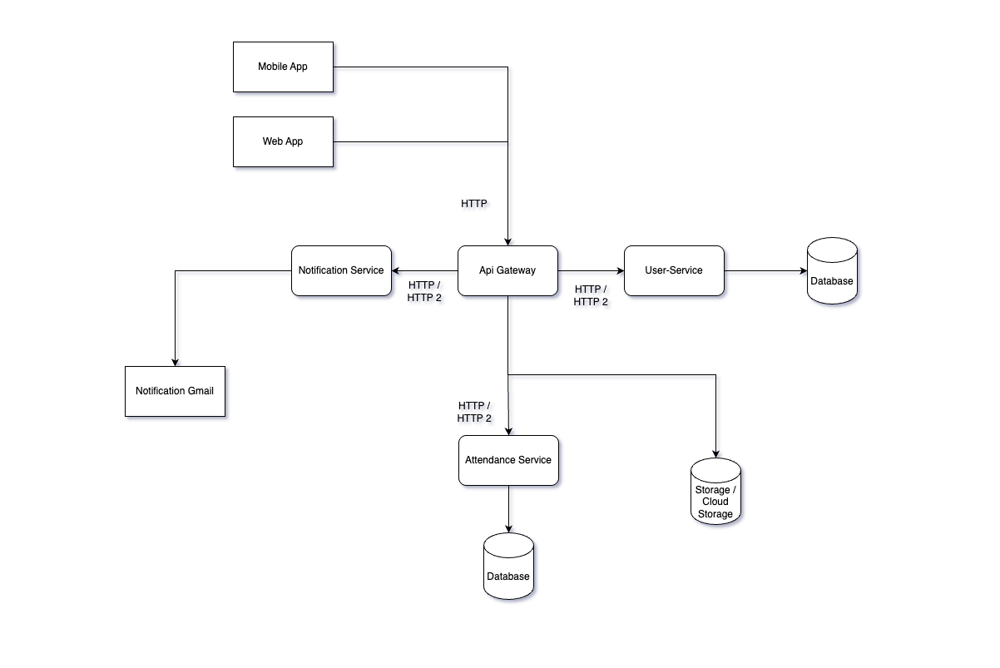

# Employee Attendance System Design

Sistem ini dirancang untuk mendukung kebutuhan 25.000+ karyawan dari sebuah perusahaan ritel yang menerapkan kebijakan Work From Anywhere (WFA). Karyawan tersebar di seluruh wilayah Indonesia dan sebagian di luar negeri. Tujuan dari sistem ini adalah mencatat dan memantau kehadiran karyawan dengan dukungan lokasi, waktu, dan validasi yang kuat.

## Assumptions

- Perusahaan memiliki +- 25.000 karyawan tersebar di seluruh Indonesia dan beberapa bekerja di luar negeri (WFA).
- Karyawan melakukan absensi melalui aplikasi mobile (Android/iOS) atau web.
- Absensi menggunakan geolocation dan selfie verification (facial detection) untuk menghindari kecurangan.
- Sistem memiliki timezone awareness (jam lokal karyawan sesuai lokasi).
- Tersedia fitur cuti, izin, dan absensi manual jika terjadi kesalahan teknis.
- Setiap karyawan hanya bisa absen jika berada di lokasi yang diizinkan (bisa didefinisikan oleh admin).

---

## Functional Requirements

- Karyawan dapat:
  - Melakukan absensi masuk & keluar
  - Melihat histori absensi
  - Mengajukan cuti/izin
- Admin dapat:
  - Melihat dashboard laporan absensi
  - Melihat anomali (tidak absen, telat, lokasi tidak valid, dsb)
  - Menyusun shift dan jadwal kerja
  - Mengekspor laporan absensi
- Sistem dapat:
  - Mendeteksi spoofing (absensi palsu) via GPS/Face Check
  - Menyesuaikan waktu berdasarkan zona waktu pengguna
  - Mengirim notifikasi saat lupa absen keluar

---

## Non-Functional Requirements

| Requirement          | Detail                                                   |
| -------------------- | -------------------------------------------------------- |
| Availability         | 99.9% uptime, highly available via cloud infrastructure  |
| Scalability          | Mampu menangani 25.000+ karyawan aktif secara paralel    |
| Security             | JWT Auth, SSL/TLS, encrypted face images, anti-spoofing  |
| Performance          | Respons time < 300ms untuk permintaan absensi            |
| Compatibility        | Mobile App (Android/iOS), Web browser                    |
| Logging & Monitoring | Tersedia log aktivitas, error tracking, dan sistem audit |
| Backup               | Backup harian database absensi dan metadata selfie       |

---

## Core Entities (ERD)

1. Users

   - id: CHAR(36) PRIMARY KEY
   - email: VARCHAR(255) UNIQUE NOT NULL
   - password: TEXT NOT NULL
   - full_name: VARCHAR(255) NOT NULL
   - role: ENUM('admin', 'hr', 'manager', 'employee')
   - location: VARCHAR(255)
   - timezone: VARCHAR(100)
   - photo_url: TEXT
   - status: ENUM('active', 'inactive', 'terminated', 'suspended')
   - email_verified_at: DATETIME
   - created_at, updated_at, deleted_at: DATETIME

2. Employees

   - id: CHAR(36) PRIMARY KEY
   - user_id: CHAR(36) FOREIGN KEY
   - department_id: CHAR(36) FOREIGN KEY
   - name: VARCHAR(255)
   - email: VARCHAR(255) UNIQUE
   - role: VARCHAR(100)
   - location: VARCHAR(255)
   - timezone: VARCHAR(100)
   - photo_url: TEXT
   - status: ENUM('active', 'inactive', 'terminated', 'suspended')
   - join_date: DATE
   - reporting_to: CHAR(36)

3. Attendances

   - id: CHAR(36) PRIMARY KEY
   - employee_id: CHAR(36) FOREIGN KEY
   - date: DATE
   - check_in_time: DATETIME
   - check_out_time: DATETIME
   - type: VARCHAR(50)
   - location: VARCHAR(255)
   - work_location_id: CHAR(36)
   - selfie_url: TEXT
   - status: ENUM('present', 'absent', 'late', 'early_leave')
   - device_info: JSON
   - ip_address: VARCHAR(45)
   - created_at, updated_at: DATETIME

4. Schedules

   - id: CHAR(36) PRIMARY KEY
   - employee_id: CHAR(36) FOREIGN KEY
   - date: DATE
   - shift_start: TIME
   - shift_end: TIME
   - break_start: TIME
   - break_end: TIME
   - work_location_id: CHAR(36)
   - schedule_type: ENUM('regular', 'shift', 'flexible')
   - created_at, updated_at: DATETIME

5. LeaveRequests

   - id: CHAR(36) PRIMARY KEY
   - employee_id: CHAR(36) FOREIGN KEY
   - start_date: DATE
   - end_date: DATE
   - type: ENUM('annual', 'sick', 'unpaid', 'maternity', 'paternity')
   - reason: TEXT
   - status: ENUM('pending', 'approved', 'rejected')
   - reviewed_by: VARCHAR(255)
   - reviewed_at: TIMESTAMP
   - note: TEXT
   - created_at, updated_at: DATETIME

6. AbsenceAnomalies

   - id: CHAR(36) PRIMARY KEY
   - employee_id: CHAR(36) FOREIGN KEY
   - date: DATE
   - type: ENUM('late', 'not_present', 'left_early', 'forgot_checkin')
   - note: TEXT
   - verified: BOOLEAN
   - verified_by: VARCHAR(255)
   - verified_at: TIMESTAMP
   - created_at: DATETIME

7. Notifications

   - id: CHAR(36) PRIMARY KEY
   - employee_id: CHAR(36) FOREIGN KEY
   - type: ENUM('reminder', 'warning', 'info')
   - message: TEXT
   - send_at: DATETIME
   - created_at: DATETIME

8. Departments

   - id: CHAR(36) PRIMARY KEY
   - name: VARCHAR(255)
   - head_employee_id: CHAR(36)
   - location: VARCHAR(255)
   - timezone: VARCHAR(100)
   - wfa_policy: JSON
   - created_at, updated_at: DATETIME

9. WorkLocations

   - id: CHAR(36) PRIMARY KEY
   - name: VARCHAR(255)
   - address: TEXT
   - country_code: VARCHAR(10)
   - latitude: DECIMAL(10,8)
   - longitude: DECIMAL(11,8)
   - radius: INTEGER
   - status: ENUM('active', 'inactive')
   - created_at, updated_at: DATETIME

10. EmployeeWorkLocations

    - id: CHAR(36) PRIMARY KEY
    - employee_id: CHAR(36) FOREIGN KEY
    - work_location_id: CHAR(36) FOREIGN KEY
    - is_primary: BOOLEAN
    - created_at, updated_at: DATETIME

11. Holidays

    - id: CHAR(36) PRIMARY KEY
    - date: DATE
    - name: VARCHAR(255)
    - description: TEXT
    - country_code: VARCHAR(10)
    - is_national: BOOLEAN
    - created_at, updated_at: DATETIME

12. Devices

    - id: CHAR(36) PRIMARY KEY
    - employee_id: CHAR(36) FOREIGN KEY
    - device_id: VARCHAR(255) UNIQUE
    - device_type: VARCHAR(50)
    - os_version: VARCHAR(50)
    - app_version: VARCHAR(50)
    - created_at, updated_at: DATETIME

13. DeviceLogs
    - id: CHAR(36) PRIMARY KEY
    - device_id: CHAR(36) FOREIGN KEY
    - ip_address: VARCHAR(45)
    - user_agent: TEXT
    - event: VARCHAR(50)
    - created_at: DATETIME

---

## Use Cases

1. **User Registration**
   - User can register with their email and password.
   - User can register as an employee or admin.
   - User can register with a profile photo.
2. **User Login**
   - User can login with their email and password.
   - User can login with their social media account.
3. **User Profile**
   - User can view their profile.
   - User can update their profile.
   - User can upload a profile photo.
4. **Attendance**
   - User can view their attendance history.
   - User can view their attendance summary.
   - User can view their attendance map.
   - User can view their attendance report.
5. **Leave Management**
   - User can view their leave history.
   - User can apply for leave.
   - User can view their leave balance.
   - User can view their leave status.
6. **Schedule Management**
   - User can view their schedule.
   - User can view their schedule details.
   - User can update their schedule.
7. **Anomaly Detection**
   - User can view their anomaly history.
   - User can view their anomaly details.
   - User can view their anomaly report.
8. **Notification**
   - User can view their notification history.
   - User can view their notification details.
   - User can mark their notification as read.
9. **Report Generation**
   - User can generate attendance report.
   - User can generate leave report.
   - User can generate attendance summary report.
10. **Admin Dashboard**
    - Admin can view attendance summary.
    - Admin can view attendance history.
    - Admin can view attendance map.
    - Admin can view attendance report.
    - Admin can view leave history.
    - Admin can view leave report.
    - Admin can view anomaly history.
    - Admin can view anomaly report.
    - Admin can view user profile.
    - Admin can view user attendance history.
    - Admin can view user leave history.
    - Admin can view user anomaly history.

## System Architecture

**Komponen:**

Komponen Teknologi

- **Frontend:** React.js / VueJS / NextJS (Web), Flutter / React Native (Mobile)
- **Backend Golang:** NodeJS / Golang / Laravel (Express, Gin, Lumen)
- **API Gateway:** Kong / NGINX Reverse Proxy
- **Database:** PostgreSQL / MySQL
- **File Storage:** Amazon S3 / Google Cloud Storage
- **Authentication:** JWT / OAuth2 + LDAP / Firebase Authentication
- **Message Queue:** RabbitMQ / Apache Kafka (untuk notifikasi dan pemrosesan async)
- **Monitoring Prometheus:** + Grafana
- **CI/CD:** GitHub Actions / GitLab CI
- **Containerization:** Docker + Kubernetes (EKS / GKE / Self-hosted)

- **Mobile/Web Client:** untuk absensi dan manajemen pengguna.
- **API Gateway:** mengatur traffic, autentikasi, rate-limiting.
- **Attendance Service:** logic utama absensi, validasi lokasi/selfie.
- **User Service:** autentikasi & manajemen data karyawan.
- **Notification Service:** kirim reminder, notifikasi cuti/izin.
- **Storage Service (e.g. S3):** simpan foto selfie dan log lokasi.
- **Database (PostgreSQL/MySQL):** penyimpanan data absensi dan user.
- **Monitoring (Grafana, Prometheus):** memantau kesehatan sistem.

---

## High Level Flow

1. Authentication Flow

   - User melakukan login melalui mobile app/web
   - Sistem memvalidasi kredensial
   - User mendapatkan akses sesuai role
   - Sistem menyimpan session info

2. Attendance Flow

   - Karyawan membuka fitur absensi
   - Sistem memvalidasi jadwal kerja
   - Sistem mengecek lokasi via GPS
   - Sistem memvalidasi radius lokasi kerja
   - Karyawan melakukan selfie
   - Sistem melakukan face recognition
   - Sistem mencatat waktu & lokasi
   - Sistem mengirim notifikasi sukses/gagal

3. Leave Management Flow

   - Karyawan mengajukan cuti/izin
   - Sistem memvalidasi sisa cuti
   - Sistem mengirim notifikasi ke approver
   - Approver mereview pengajuan
   - Sistem memperbarui status cuti
   - Sistem mengupdate attendance record
   - Sistem mengirim notifikasi hasil

4. Schedule Management Flow

   - Admin membuat jadwal kerja
   - Sistem memvalidasi konflik jadwal
   - Sistem mengirim notifikasi ke karyawan
   - Karyawan menerima jadwal baru
   - Sistem mengupdate database

5. Anomaly Detection Flow

   - Sistem mendeteksi anomali absensi
   - Sistem mencatat jenis anomali
   - Sistem mengirim notifikasi ke admin/HR
   - Admin/HR melakukan verifikasi
   - Sistem mengupdate status anomali

6. Notification Flow

   - Sistem mengecek trigger events
   - Sistem mempersiapkan template notifikasi
   - Sistem menentukan recipient
   - Sistem mengirim notifikasi
   - Sistem mencatat status pengiriman

7. Report Generation Flow

   - Admin memilih jenis laporan
   - Sistem mengumpulkan data
   - Sistem memproses data
   - Sistem menghasilkan laporan
   - Sistem menyimpan history laporan
